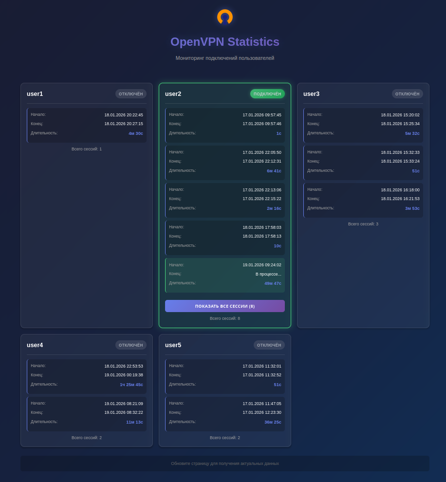

# Description  
It is simple web-app viewer of OpenVPN connections  


# Build  
Go need to be [installed](https://go.dev/doc/install). Simply run:  

```
make
```

# Usage  

```
ovpn-stat [-c configFile] [-h] [-v]
  -c string
        Path to config file (default "config.yml")
  -h    Show this help
  -v    Show version information
```

# Config  

```
server:
  log: path_to_log
  port: port_to_listen

auth:
  username: user
  password: password
  
```

# Systemd  
Edit ovpn-stat.service. Then:  

```
sudo cp ovpn-stat.service /etc/systemd/system/ovpn-stat.service
sudo systemctl daemon-reload
sudo systemctl enable ovpn-stat
sudo systemctl start ovpn-stat
```
